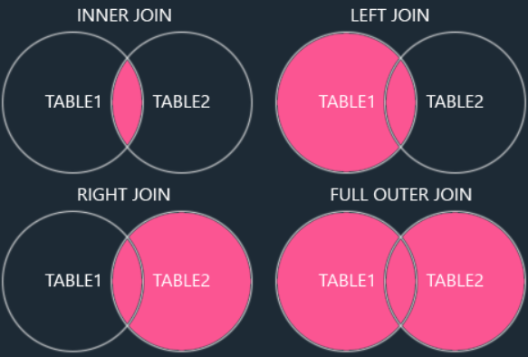

# DB and SQL

### **Author : Arnab Dana**

Resource

[https://www.w3schools.com/sql/default.asp](https://www.w3schools.com/sql/default.asp)

Content

1.  Category of Queries

2.  Introduction

3.  DQL (Data Query Language)

4.  Regex

5.  SQL Operator

6.  DDL (Data Definition Language)

7.  DML (Data Manipulation Language)

8.  DCL (Data Control Language)

9.  TCL (Transaction Control Language)

10.  Aggregate Functions

11.  Joins

12.  Execution Sequence of Clause

13.  Creating Custom Functions in SQL

14.  SQL NULL Functions

15.  Stored Procedures

16.  SQL Constraints

17.  SQL Indexing

18.  Other Topics

19.  Data Types

20.  Quick Reference

1\. Category of Queries

In SQL, queries are categorized into different types based on the kind of operations they perform on the database. The main categories are:

|     |     |     |     |
| --- | --- | --- | --- |
| **Category** | **Full Form** | **Purpose** | **Examples** |
| **DDL** | Data Definition Language | Defines and modifies database structure | `CREATE`, `ALTER`, `DROP`, `TRUNCATE` |
| **DML** | Data Manipulation Language | Manipulates data within tables | `INSERT`, `UPDATE`, `DELETE`, `MERGE` |
| **DQL** | Data Query Language | Retrieves data from the database | `SELECT` |
| **DCL** | Data Control Language | Controls access to data and permissions | `GRANT`, `REVOKE` |
| **TCL** | Transaction Control Language | Manages transactions to maintain database integrity | `COMMIT`, `ROLLBACK`, `SAVEPOINT` |

2\. Introduction

What is a Database?

A database is an organized collection of data that is stored and accessed electronically.  
Think of it as a digital filing system where information is stored in a structured way,  
making it easy to retrieve, manage, and update.  

1.  Structured Storage:  
    Data is stored in a specific format, often in tables with rows and columns, making it easy to query and analyze.  
    

2.  Consistency: The data stored is consistent, meaning that the same type of data is stored in the same way across the database.

3.  Integrity: Data integrity ensures that the data is accurate and reliable.

4.  Scalability: Databases can grow in size, handling more data without performance issues.

- - -

Question) What is a Database Management System (DBMS)?

A Database Management System (DBMS) is software that allows users to create, manage, and interact with databases. It acts as an intermediary between the user and the database, enabling users to easily retrieve, insert, update, and delete data while ensuring that the data is secure and consistent.

- - -

Question) What is Relational Database Management System (DBMS)?

RDBMS stands for Relational Database Management System. It is a type of database management system (DBMS) that stores data in a structured format, using rows and columns, which are organized into tables. The key feature of an RDBMS is that it uses relationships (or links) between tables to manage and query data efficiently.

Here are some key points about RDBMS:

a) Tables: Data is stored in tables, where each table consists of rows (records) and columns (attributes).

b) Primary Key: Each table typically has a primary key, a unique identifier for each row in the table.

c) Foreign Key: Relationships between tables are established using foreign keys, which are fields in one table that refer to the primary key in another table.  
SQL (Structured Query Language): RDBMS systems use SQL for querying, updating, and managing the data.  

d) Normalization: RDBMSs often involve the normalization process, which organizes data to minimize redundancy and dependency.  
Examples of popular RDBMSs include MySQL, PostgreSQL, Microsoft SQL Server, and Oracle Database.  

- - -

Question) What is SQL ?

SQL (Structured Query Language) is a standardized programming language used to manage and manipulate relational databases. It is the primary language used for querying, inserting, updating, and deleting data in relational databases, as well as for creating and modifying the database structure itself.

Here are the key components of SQL:

1.  Data Query Language (DQL): Used to query data from the database.  
    The most common command is SELECT.  
    

2.  Data Manipulation Language (DML): Used to insert, update, and delete data.

3.  Data Definition Language (DDL): Used to define or alter the structure of the database, such as creating, altering, or dropping tables.

4.  Data Control Language (DCL): Used to control access to the data, like granting and revoking permissions.

5.  Transaction Control Language (TCL): Used to manage transactions in the database, ensuring data integrity.

COMMIT; (saves all changes made in the current transaction)  
ROLLBACK; (undoes all changes made in the current transaction)  

3\. **DQL (**Data Query Language)

1.  Read Data from Customers Table

```SQL
SELECT * FROM Customers; // * mean all column
SELECT CustomerName, City FROM Customers;
```

2.  DISTINCT

```SQL
SELECT DISTINCT Country FROM Customers;
SELECT COUNT(DISTINCT column_name) AS DistinctCountries FROM table_name;
```

3.  **WHERE Clause**

```SQL
SELECT * FROM Customers
WHERE Country='Mexico';
```

4.  **ORDER BY**

```SQL
SELECT * FROM Products
ORDER BY Price;
SELECT column1, column2, ...
FROM table_name
ORDER BY column1, column2, ... ASC|DESC;
SELECT * FROM Customers
ORDER BY Country ASC, CustomerName DESC;
```

5.  TOP
    
    Retrieves a specified number of rows from a result set.
    

```SQL
SELECT TOP number | percentage columns
FROM table_name
WHERE condition;
//Example: Get the top 5 highest-paid employees
SELECT TOP 5 * FROM Employees ORDER BY Salary DESC;
//Example: Get the top 10% of employees
SELECT TOP 10 PERCENT * FROM Employees ORDER BY Salary DESC;
```

6.  LIMIT
    
    Retrieves a specific number of rows.
    

```SQL
SELECT columns FROM table_name
WHERE condition
LIMIT number;
//Example: Get the top 5 employees
SELECT * FROM Employees ORDER BY Salary DESC LIMIT 5;

//Example: Get rows 5 to 10 (Pagination)
SELECT * FROM Employees ORDER BY EmployeeID LIMIT 5 OFFSET 5;
```

7.  FETCH FIRST  
    Works similarly to  
    `LIMIT`.

```SQL
SELECT columns FROM table_name
ORDER BY column_name
FETCH FIRST number ROWS ONLY;

SELECT * FROM Employees FETCH FIRST 5 ROWS ONLY;
```

8.  ROWNUM  
    Filters rows  
    **before** sorting (needs a subquery for correct results).

```SQL
SELECT * FROM table_name WHERE ROWNUM <= number;

SELECT * FROM 
(SELECT * FROM Employees ORDER BY Salary DESC) 
WHERE ROWNUM <= 5;
```

9.  **Alias**
    
    Rename a column
    

```SQL
SELECT COUNT(*) AS [Number of records]
FROM Products;
```

10.  **GROUP BY**

```SQL
SELECT column_name(s)
FROM table_name
WHERE condition
GROUP BY column_name(s)
ORDER BY column_name(s);

SELECT COUNT(CustomerID), Country
FROM Customers
GROUP BY Country;
```

11.  **HAVING** 

```SQL
SELECT column_name(s)
FROM table_name
WHERE condition
GROUP BY column_name(s)
HAVING condition
ORDER BY column_name(s);

SELECT COUNT(CustomerID), Country
FROM Customers
GROUP BY Country
HAVING COUNT(CustomerID) > 5
ORDER BY COUNT(CustomerID) DESC;
```

12.  **EXISTS** 
    
    The `EXISTS` operator is used to test for the existence of any record in a subquery.
    

```SQL
SELECT column_name(s)
FROM table_name
WHERE EXISTS
(SELECT column_name FROM table_name WHERE condition);
```

13.  **SELECT INTO**
    
    The `SELECT INTO` statement copies data from one table into a new table.
    

```SQL
SELECT *
INTO newtable [IN externaldb]
FROM oldtable
WHERE condition;
// The following SQL statement creates a backup copy of Customers:
SELECT * INTO CustomersBackup2017
FROM Customers;
//The following SQL statement uses the IN clause to copy the table into a new table in another database:
SELECT * INTO CustomersBackup2017 IN 'Backup.mdb'
FROM Customers;
```

14.  **CASE Expression**

```SQL
CASE
    WHEN condition1 THEN result1
    WHEN condition2 THEN result2
    WHEN conditionN THEN resultN
    ELSE result
END;
//2
SELECT OrderID, Quantity,
CASE
    WHEN Quantity > 30 THEN 'The quantity is greater than 30'
    WHEN Quantity = 30 THEN 'The quantity is 30'
    ELSE 'The quantity is under 30'
END AS QuantityText
FROM OrderDetails;
	//OrderID	 Quantity	 QuantityText
	//10248	   12	       The quantity is under 30
	//10248	   10	       The quantity is under 30
	//10248	   5	       The quantity is under 30
//3
SELECT CustomerName, City, Country
FROM Customers
ORDER BY
(CASE
    WHEN City IS NULL THEN Country
    ELSE City
END);
```

aa

```SQL
a
```

4\. Regex

SQL supports **regular expressions (regex)** in some database systems, like MySQL, PostgreSQL, and Oracle, for pattern matching beyond `LIKE`. Here are some commonly used regex patterns in SQL:

### **Basic Wildcards (**`**LIKE**` **Operator)**

|     |     |     |
| --- | --- | --- |
| Symbol | Description | Example |
| `%` | Matches zero or more characters | `WHERE name LIKE 'A%'` (Names starting with 'A') |
| `_` | Matches a single character | `WHERE name LIKE 'J_n'` (Matches 'Jon', 'Jan', etc.) |
| \-  | Represents any single character within the specified range \* | `WHERE CustomerName LIKE '[a-f]%';      `Return all customers starting with "a", "b", "c", "d", "e" or "f": |

### **Regex Patterns (**`**REGEXP**` **or** `**SIMILAR TO**`**)** _(Depends on SQL Database)_

|     |     |     |
| --- | --- | --- |
| Regex Pattern | Description | Example |
| `^` | Start of string | `WHERE name REGEXP '^A'` (Names starting with 'A') |
| `$` | End of string | `WHERE email REGEXP 'gmail.com$'` (Emails ending with 'gmail.com') |
| `.` | Matches any single character | `WHERE name REGEXP 'J.n'` (Matches 'Jon', 'Jan', etc.) |
| `[abc]` | Matches any character in brackets | `WHERE name REGEXP '[JKT]ohn'` (Matches 'John', 'Kohn', or 'Tohn') |
| `[^abc]` | Matches any character _not_ in brackets | `WHERE name REGEXP '[^JK]ohn'` (Excludes 'John' & 'Kohn') |
| `[a-z]` | Matches any character in a range | `WHERE name REGEXP '[a-d]an'` (Matches 'Aman', 'Bman', etc.) |
| `*` | Matches 0 or more occurrences of the previous character | `WHERE name REGEXP 'A*'` (Matches '', 'A', 'AA', etc.) |
| `+` | Matches 1 or more occurrences of the previous character | `WHERE name REGEXP 'A+'` (Matches 'A', 'AA', but not '') |
| `?` | Matches 0 or 1 occurrence of the previous character | `WHERE name REGEXP 'colou?r'` (Matches 'color' & 'colour') |
| `{n,m}` | Matches between `n` and `m` occurrences | `WHERE name REGEXP 'A{2,4}'` (Matches 'AA', 'AAA', or 'AAAA') |

### **Special SQL-Specific Regex Usage**

|     |     |     |
| --- | --- | --- |
| Database | Regex Support | Example |
| MySQL | `REGEXP` operator | `SELECT * FROM users WHERE name REGEXP '^[A-Z].*son$';` |
| PostgreSQL | `~` (case-sensitive), `~*` (case-insensitive) | `SELECT * FROM users WHERE name ~ '^John';` |
| Oracle | `REGEXP_LIKE()` function | `SELECT * FROM employees WHERE REGEXP_LIKE(name, '^A');` |

### Coding example

Here are some MySQL code examples demonstrating regular expressions in SQL:

### **Basic Wildcards with** `**LIKE**`

|     |     |     |
| --- | --- | --- |
| Use Case | Query | Description |
| Find names starting with 'A' | `SELECT * FROM users WHERE name LIKE 'A%';` | Matches names like 'Alice', 'Adam' |
| Find names with 'o' as second letter | `SELECT * FROM users WHERE name LIKE '_o%';` | Matches 'John', 'Tony' |
| Find names ending with 'son' | `SELECT * FROM users WHERE name LIKE '%son';` | Matches 'Jackson', 'Emerson' |

### **Using** `**REGEXP**` **for Advanced Matching**

|     |     |     |
| --- | --- | --- |
| Use Case | Query | Description |
| Names starting with 'A' | `SELECT * FROM users WHERE name REGEXP '^A';` | Matches 'Alice', 'Andrew' |
| Names ending with 'n' | `SELECT * FROM users WHERE name REGEXP 'n$';` | Matches 'John', 'Ethan' |
| Names containing 'o' | `SELECT * FROM users WHERE name REGEXP 'o';` | Matches 'John', 'Tony' |
| Names with exactly 5 letters | `SELECT * FROM users WHERE name REGEXP '^.{5}$';` | Matches 'James', 'David' |
| Names containing 'a', 'b', or 'c' | `SELECT * FROM users WHERE name REGEXP '[abc]';` | Matches 'Alice', 'Bob', 'Charlie' |
| Names not containing 'x' or 'z' | `SELECT * FROM users WHERE name REGEXP '^[^xz]+$';` | Excludes 'Xavier', 'Zane' |
| Names with double 'o' | `SELECT * FROM users WHERE name REGEXP 'o{2}';` | Matches 'Cooper', 'Brooklyn' |
| Emails from Gmail | `SELECT * FROM users WHERE email REGEXP 'gmail\\.com$';` | Matches emails ending in 'gmail.com' |

### **3\. Case-Insensitive Matching in MySQL (**`**BINARY**` **and** `**LOWER()**` **for workaround)**

|     |     |     |
| --- | --- | --- |
| Use Case | Query | Description |
| Case-insensitive match for 'john' | `SELECT * FROM users WHERE LOWER(name) REGEXP 'john';` | Matches 'John', 'john' |
| Case-sensitive match for 'John' | `SELECT * FROM users WHERE name REGEXP BINARY 'John';` | Matches 'John', but not 'john' |

5\. SQL Operator

|     |     |     |     |
| --- | --- | --- | --- |
| **Operator Type** | **Operator** | **Example** | **Description** |
| **Arithmetic** | `+` | `SELECT 10 + 5;` | Returns `15` |
|     | `-` | `SELECT 10 - 5;` | Returns `5` |
|     | `*` | `SELECT 10 * 5;` | Returns `50` |
|     | `/` | `SELECT 10 / 5;` | Returns `2` |
|     | `%` | `SELECT 10 % 3;` | Returns `1` (remainder) |
| **Comparison** | `=` | `SELECT * FROM employees WHERE salary = 50000;` | Selects employees with a salary of 50,000 |
|     | `!=` or `<>` | `SELECT * FROM employees WHERE age <> 30;` | Selects employees not 30 years old |
|     | `>` | `SELECT * FROM products WHERE price > 100;` | Selects products priced above 100 |
|     | `<` | `SELECT * FROM orders WHERE quantity < 50;` | Selects orders with quantity below 50 |
|     | `>=` | `SELECT * FROM students WHERE marks >= 80;` | Selects students scoring 80 or above |
|     | `<=` | `SELECT * FROM books WHERE pages <= 300;` | Selects books with 300 pages or less |
| **Logical** | `AND` | `SELECT * FROM customers WHERE city = 'New York' AND age > 25;` | Selects customers from New York older than 25 |
|     | `OR` | `SELECT * FROM employees WHERE department = 'IT' OR department = 'HR';` | Selects employees in IT or HR department |
|     | `NOT` | `SELECT * FROM orders WHERE NOT status = 'Cancelled';` | Selects orders that are not cancelled |
| **Bitwise** | `&` | `SELECT 5 & 3;` | Returns `1` (Bitwise AND) |
|     | \`  | \`  | \`SELECT 5 |
|     | `^` | `SELECT 5 ^ 3;` | Returns `6` (Bitwise XOR) |
| **Assignment** | `:=` or `=` | `SET @x := 10;` | Assigns `10` to `@x` (MySQL) |
| **Set** | `IN` | `SELECT * FROM employees WHERE department IN ('HR', 'Finance');` | Selects employees in HR or Finance |
|     | `NOT IN` | `SELECT * FROM students WHERE class NOT IN ('10A', '10B');` | Selects students not in class 10A or 10B |
| **Pattern Matching** | `LIKE` | `SELECT * FROM customers WHERE name LIKE 'A%';` | Selects names starting with 'A' |
|     | `NOT LIKE` | `SELECT * FROM customers WHERE name NOT LIKE '%son';` | Selects names that do not end with 'son' |
| **Null Handling** | `IS NULL` | `SELECT * FROM employees WHERE manager_id IS NULL;` | Selects employees without a manager |
|     | `IS NOT NULL` | `SELECT * FROM employees WHERE salary IS NOT NULL;` | Selects employees with a salary value |
| **Existence** | `EXISTS` | `SELECT * FROM customers WHERE EXISTS (SELECT 1 FROM orders WHERE customers.id = orders.customer_id);` | Selects customers who have placed orders |
|     | `NOT EXISTS` | `SELECT * FROM customers WHERE NOT EXISTS (SELECT 1 FROM orders WHERE customers.id = orders.customer_id);` | Selects customers without orders |
| **Range** | `BETWEEN` | `SELECT * FROM products WHERE price BETWEEN 50 AND 100;` | Selects products priced between 50 and 100 |
|     | `NOT BETWEEN` | `SELECT * FROM students WHERE marks NOT BETWEEN 40 AND 80;` | Selects students scoring outside 40-80 |
| **String Concatenation** | \`  |     | `or`CONCAT()\` |
|     | `CONCAT()` | `SELECT CONCAT('Hello', ' ', 'World');` (MySQL) | Returns `Hello World` |
| **Other Special Operators** | `UNION` | `SELECT name FROM customers UNION SELECT name FROM suppliers;` | Combines unique customer and supplier names |
|     | `UNION ALL` | `SELECT name FROM customers UNION ALL SELECT name FROM suppliers;` | Combines customer and supplier names, including duplicates |

|     |     |     |     |
| --- | --- | --- | --- |
| Operator Type | Operator | Example | Description |
| Logical | ALL | `SELECT * FROM Employees WHERE Salary > ALL (SELECT Salary FROM Interns);` | TRUE if all of the subquery values meet the condition. |
| Logical | AND | `SELECT * FROM Employees WHERE Age > 30 AND Department = 'IT';` | TRUE if all the conditions separated by AND are TRUE. |
| Logical | ANY | `SELECT * FROM Employees WHERE Salary > ANY (SELECT Salary FROM Interns);` | TRUE if any of the subquery values meet the condition. |
| Comparison | BETWEEN | `SELECT * FROM Employees WHERE Salary BETWEEN 30000 AND 70000;` | TRUE if the operand is within the range of comparisons. |
| Logical | EXISTS | `SELECT * FROM Employees WHERE EXISTS (SELECT 1 FROM Departments WHERE Employees.DeptID = Departments.ID);` | TRUE if the subquery returns one or more records. |
| Comparison | IN  | `SELECT * FROM Employees WHERE Department IN ('HR', 'IT', 'Finance');` | TRUE if the operand is equal to one of a list of expressions. |
| Pattern Matching | LIKE | `SELECT * FROM Employees WHERE Name LIKE 'A%';` | TRUE if the operand matches a pattern. |
| Logical | NOT | `SELECT * FROM Employees WHERE NOT (Department = 'HR');` | Displays a record if the condition(s) is NOT TRUE. |
| Logical | OR  | `SELECT * FROM Employees WHERE Age < 25 OR Experience > 5;` | TRUE if any of the conditions separated by OR are TRUE. |
| Logical | SOME | `SELECT * FROM Employees WHERE Salary > SOME (SELECT Salary FROM Interns);` | TRUE if any of the subquery values meet the condition. |

6\. **DDL (**Data Definition Language)

`CREATE`, `ALTER`, `DROP`, `TRUNCATE`

### **Data Definition Language (DDL) in SQL**

DDL commands are used to define and modify the structure of database objects such as tables, indexes, and schemas. These commands include:

### **1\. CREATE** – Creates a new database object (e.g., table, database, index).

### **Example: Create a Table**

```SQL
CREATE TABLE Employees (
    EmployeeID INT PRIMARY KEY,
    Name VARCHAR(100),
    Age INT,
    Department VARCHAR(50)
);
```

### **Example: Create a Database**

```SQL
CREATE DATABASE CompanyDB;
```

### **Example: Create an Index**

```SQL
CREATE INDEX idx_employee_name ON Employees(Name);
```

### **2\. ALTER** – Modifies the structure of an existing table or other database objects.

### **Example: Add a Column**

```SQL
ALTER TABLE Employees ADD Salary DECIMAL(10,2);
```

### **Example: Modify Column Data Type**

```SQL
ALTER TABLE Employees MODIFY Age SMALLINT;
```

### **Example: Rename a Column**

```SQL
ALTER TABLE Employees RENAME COLUMN Name TO FullName;
```

### **Example: Drop a Column**

```SQL
ALTER TABLE Employees DROP COLUMN Department;
```

### **3\. DROP** – Deletes database objects permanently.

### **Example: Drop a Table**

```SQL
DROP TABLE Employees;
```

### **Example: Drop a Database**

```SQL
DROP DATABASE CompanyDB;
```

### **Example: Drop an Index**

```SQL
DROP INDEX idx_employee_name ON Employees;
```

### **4\. TRUNCATE** – Removes all rows from a table without logging individual row deletions.

### **Example: Truncate a Table**

```SQL
TRUNCATE TABLE Employees;
```

> Note: Unlike DROP, TRUNCATE keeps the table structure intact but deletes all records efficiently.

### **5\. RENAME** – Renames an existing database object.

### **Example: Rename a Table**

```SQL
RENAME TABLE Employees TO Staff;
```

These are the core **DDL (Data Definition Language) commands** used to define and manage database structures.

7\. **DML (**Data Manipulation Language)

`INSERT`, `UPDATE`, `DELETE`, `MERGE`

### **Data Manipulation Language (DML) in SQL**

DML commands are used to manipulate and manage data within database tables. These commands include:

- - -

### **1\. INSERT** – Adds new records to a table.

```SQL
INSERT INTO table2
SELECT * FROM table1
WHERE condition;
//Copy "Suppliers" into "Customers" (the columns that are not filled with data, will contain NULL):
INSERT INTO Customers (CustomerName, City, Country)
SELECT SupplierName, City, Country FROM Suppliers;
```

### **Example: Insert a Single Row**

```SQL
INSERT INTO Employees (EmployeeID, Name, Age, Department, Salary)
VALUES (1, 'John Doe', 30, 'IT', 60000);
```

### **Example: Insert Multiple Rows**

```SQL
INSERT INTO Employees (EmployeeID, Name, Age, Department, Salary)
VALUES
    (2, 'Jane Smith', 28, 'HR', 55000),
    (3, 'Michael Johnson', 35, 'Finance', 70000);
```

### **2\. UPDATE** – Modifies existing records in a table.

### **Example: Update a Single Record**

```SQL
UPDATE Employees
SET Salary = 65000
WHERE EmployeeID = 1;
```

### **Example: Update Multiple Records**

```SQL
UPDATE Employees
SET Department = 'Admin'
WHERE Department = 'HR';
```

### **3\. DELETE** – Removes records from a table.

### **Example: Delete a Single Record**

```SQL
DELETE FROM Employees
WHERE EmployeeID = 1;
```

### **Example: Delete Multiple Records**

```SQL
DELETE FROM Employees
WHERE Department = 'Admin';
```

> Note: DELETE removes specific rows, but the table structure remains intact. Use TRUNCATE (DDL) to remove all records efficiently.

### **4\. MERGE** – Inserts, updates, or deletes data in a table based on a condition (used in advanced scenarios).

### **Example: Merge Data (Upsert)**

```SQL
MERGE INTO Employees AS target
USING (SELECT 3 AS EmployeeID, 'Michael Johnson' AS Name, 36 AS Age, 'Finance' AS Department, 75000 AS Salary) AS source
ON target.EmployeeID = source.EmployeeID
WHEN MATCHED THEN
    UPDATE SET Name = source.Name, Age = source.Age, Salary = source.Salary
WHEN NOT MATCHED THEN
    INSERT (EmployeeID, Name, Age, Department, Salary)
    VALUES (source.EmployeeID, source.Name, source.Age, source.Department, source.Salary);
```

> Note: MERGE is useful for UPSERT (update if exists, insert if not).

8\. **DCL (**Data Control Language)

`GRANT`, `REVOKE`

### **Data Control Language (DCL) in SQL**

DCL commands are used to **manage access and permissions** for database objects like tables, views, and procedures. These commands help administrators **grant or revoke** privileges to users and roles.

- - -

## **1\. GRANT** – Assigns privileges to users or roles

The `GRANT` command is used to provide **specific permissions** to a user or role on database objects.

### **🔹 Syntax**

```SQL
GRANT permission_type ON object TO user;
```

### **🔹 Example: Granting Permissions**

```SQL
GRANT SELECT, INSERT ON Employees TO user1;
```

✅ This allows `user1` to `SELECT` and `INSERT` records into the **Employees** table.

```SQL
GRANT ALL PRIVILEGES ON Employees TO admin_user;
```

✅ This grants **all permissions** (SELECT, INSERT, UPDATE, DELETE, etc.) to `admin_user`.

```SQL
GRANT EXECUTE ON PROCEDURE sp_update_salary TO user2;
```

✅ Allows `user2` to execute the stored procedure `sp_update_salary`.

- - -

## **2\. REVOKE** – Removes previously granted privileges

The `REVOKE` command is used to **take away** specific permissions from users or roles.

### **🔹 Syntax**

```SQL
REVOKE permission_type ON object FROM user;
```

### **🔹 Example: Revoking Permissions**

```SQL
REVOKE INSERT ON Employees FROM user1;
```

✅ This removes `INSERT` permission from `user1` but does not affect other permissions.

```SQL
REVOKE ALL PRIVILEGES ON Employees FROM admin_user;
```

✅ Removes **all permissions** from `admin_user`.

```SQL
REVOKE EXECUTE ON PROCEDURE sp_update_salary FROM user2;
```

✅ Revokes permission to execute the stored procedure `sp_update_salary` from `user2`.

- - -

## **💡 Important Notes:**

✔ **DCL commands require administrative privileges.**

✔ **Privileges can be assigned to individual users or roles.**

✔ **Permissions apply to various database objects (tables, views, procedures, etc.).**

9\. **TCL (**Transaction Control Language)

`COMMIT`, `ROLLBACK`, `SAVEPOINT`

### **Transaction Control Language (TCL) in SQL**

TCL commands are used to **manage database transactions** to ensure consistency and integrity of data. These commands help in handling changes made by DML statements (`INSERT`, `UPDATE`, `DELETE`).

- - -

## **1\. COMMIT** – Saves all changes made in the current transaction

The `COMMIT` command **permanently stores** changes in the database.

### **🔹 Example: Using COMMIT**

```SQL
BEGIN TRANSACTION;
UPDATE Employees SET Salary = 65000 WHERE EmployeeID = 1;
INSERT INTO Employees VALUES (4, 'Alice Green', 27, 'Marketing', 50000);
COMMIT;
```

✅ Changes are **saved permanently** in the database.

- - -

## **2\. ROLLBACK** – Reverts all changes made in the current transaction

The `ROLLBACK` command **undoes changes** that are not yet committed.

### **🔹 Example: Using ROLLBACK**

```SQL
BEGIN TRANSACTION;
UPDATE Employees SET Salary = 70000 WHERE EmployeeID = 1;
DELETE FROM Employees WHERE EmployeeID = 3;
ROLLBACK;
```

✅ All changes are **discarded**, and the database returns to its previous state.

- - -

## **3\. SAVEPOINT** – Creates a checkpoint within a transaction

The `SAVEPOINT` command allows you to **partially roll back** a transaction to a specific point.

### **🔹 Example: Using SAVEPOINT**

```SQL
BEGIN TRANSACTION;

UPDATE Employees SET Salary = 75000 WHERE EmployeeID = 1;
SAVEPOINT sp1;  -- Savepoint created

DELETE FROM Employees WHERE EmployeeID = 3;
SAVEPOINT sp2;  -- Another Savepoint

ROLLBACK TO sp1;  -- Undo changes after sp1 (Restores EmployeeID = 3 but keeps Salary update)
COMMIT;
```

✅ The DELETE operation is undone, but the salary update remains.

- - -

## **4\. SET TRANSACTION** – Defines transaction properties

The `SET TRANSACTION` command **sets isolation levels** to control how transactions interact.

### **🔹 Example: Setting Isolation Level**

```SQL
SET TRANSACTION ISOLATION LEVEL SERIALIZABLE;
BEGIN TRANSACTION;
UPDATE Employees SET Salary = 80000 WHERE EmployeeID = 2;
COMMIT;
```

✅ Ensures **strict isolation** so that no other transactions interfere.

- - -

## **✨ Why Use TCL?**

✔ **Maintains data integrity**

✔ **Allows error handling**

✔ **Prevents accidental data loss**

10\. **Aggregate Functions**

An aggregate function is a function that performs a calculation on a set of values, and returns a single value.

Aggregate functions are often used with the `GROUP BY` clause of the `SELECT` statement. The `GROUP BY` clause splits the result-set into groups of values and the aggregate function can be used to return a single value for each group.

The most commonly used SQL aggregate functions are:

*   `MIN()` - returns the smallest value within the selected column

*   `MAX()` - returns the largest value within the selected column

*   `COUNT()` - returns the number of rows in a set

*   `SUM()` - returns the total sum of a numerical column

*   `AVG()` - returns the average value of a numerical column

Aggregate functions ignore null values (except for `COUNT()`).

|     |     |     |
| --- | --- | --- |
| Function | Description | Example Query |
| **COUNT()** | Returns the number of rows | `SELECT COUNT(*) FROM Employees;` |
| **SUM()** | Returns the sum of a numeric column | `SELECT SUM(Salary) FROM Employees;` |
| **AVG()** | Returns the average value of a numeric column | `SELECT AVG(Salary) FROM Employees;` |
| **MAX()** | Returns the maximum value in a column | `SELECT MAX(Salary) FROM Employees;` |
| **MIN()** | Returns the minimum value in a column | `SELECT MIN(Salary) FROM Employees;` |
| **GROUP BY** | Groups results based on a column for aggregation | `SELECT Department, AVG(Salary) FROM Employees GROUP BY Department;` |
| **HAVING** | Filters aggregated results | `SELECT Department, AVG(Salary) FROM Employees GROUP BY Department HAVING AVG(Salary) > 50000;` |

11\. **Joins**

[](37EB34B7-880F-451B-B2B1-866F56F5991A.png)

Here are the different types of the JOINs in SQL:

*   `(INNER) JOIN`: Returns records that have matching values in both tables

*   `LEFT (OUTER) JOIN`: Returns all records from the left table, and the matched records from the right table

*   `RIGHT (OUTER) JOIN`: Returns all records from the right table, and the matched records from the left table

*   `FULL (OUTER) JOIN`: Returns all records when there is a match in either left or right table

*   CROSS JOIN: Returns a Cartesian product (every row from Table A is combined with every row from Table B).

*   SELF JOIN: Joins a table to itself to compare rows. INNER JOIN used.

### **Syntax in SQL**

The `INNER JOIN` returns only the rows that have matching values in both tables.

```SQL
SELECT t1.column1, t1.column2, t2.column1, t2.column2
FROM table1 t1
<<Join Type>> JOIN table2 t2
ON table1.common_column = table2.common_column;
```

### **🔹 Example: INNER JOIN on Employees and Departments**

```SQL
SELECT Employees.EmployeeID, Employees.Name, Departments.DepartmentName
FROM Employees
INNER JOIN Departments
ON Employees.DepartmentID = Departments.DepartmentID;
```

12\. **Execution Sequence of Clause**

When a SQL query is executed, it follows a specific logical sequence, which is **different from the order in which the query is written**.

### **🔹 Logical Execution Order**

|     |     |     |
| --- | --- | --- |
| **Step** | **Clause** | **Description** |
| **1** | `FROM` | Specifies the source table(s) for the query. |
| **2** | `JOIN` | Combines data from multiple tables (if applicable). |
| **3** | `WHERE` | Filters records based on conditions. |
| **4** | `GROUP BY` | Groups rows based on specified column(s). |
| **5** | `HAVING` | Filters grouped records (used with `GROUP BY`). |
| **6** | `SELECT` | Selects and returns the required columns. |
| **7** | `DISTINCT` | Removes duplicate rows from the result. |
| **8** | `ORDER BY` | Sorts the final result. |
| **9** | `LIMIT` / `OFFSET` / `FETCH` | Limits the number of returned rows (used for pagination). |

- - -

Syntax

```SQL
SELECT DISTINCT column, AGG_FUNC(column_or_expression), …
FROM mytable
    JOIN another_table
      ON mytable.column = another_table.column
    WHERE constraint_expression
    GROUP BY column
    HAVING constraint_expression
    ORDER BY column ASC/DESC
    LIMIT count OFFSET COUNT;
```

### **🔹 Example SQL Query**

```SQL
SELECT DepartmentID, COUNT(EmployeeID) AS TotalEmployees
FROM Employees
WHERE Salary > 50000
GROUP BY DepartmentID
HAVING COUNT(EmployeeID) > 5
ORDER BY TotalEmployees DESC
LIMIT 10;
```

### **🔹 How SQL Executes This Query Step by Step:**

1.  `**FROM Employees**` → Selects the `Employees` table.

2.  `**WHERE Salary > 50000**` → Filters employees with a salary above 50,000.

3.  `**GROUP BY DepartmentID**` → Groups remaining employees by `DepartmentID`.

4.  `**HAVING COUNT(EmployeeID) > 5**` → Filters groups with more than 5 employees.

5.  `**SELECT DepartmentID, COUNT(EmployeeID) AS TotalEmployees**` → Selects required columns.

6.  `**ORDER BY TotalEmployees DESC**` → Sorts results in descending order.

7.  `**LIMIT 10**` → Returns only the top 10 rows.

📌 **Key Takeaways:**

✔ The **query is written in a different order than how it executes**.

✔ `WHERE` filters **before** `GROUP BY`, while `HAVING` filters **after**.

✔ `ORDER BY` and `LIMIT` are applied **at the end**.

13\. **Creating Custom Functions in SQL**

Yes! You can create your own functions in SQL using **User-Defined Functions (UDFs)**. These functions allow you to encapsulate logic and reuse it in queries.

- - -

## **Types of User-Defined Functions (UDFs)**

|     |     |     |
| --- | --- | --- |
| **Type** | **Description** | **Returns** |
| **Scalar Function** | Returns a single value | A single value (INT, VARCHAR, etc.) |
| **Table-Valued Function** | Returns a table | A table result set |
| **Aggregate Function** | Custom aggregation on multiple rows | A single aggregated value |

- - -

## **1️⃣ Scalar Function (Returns a Single Value)**

A **scalar function** returns a single value based on input parameters.

### **🔹 Example: Create a Function to Calculate Bonus**

```SQL
CREATE FUNCTION CalculateAge (@DOB DATE)  
RETURNS INT  
AS  
BEGIN  
    RETURN DATEDIFF(YEAR, @DOB, GETDATE())  
END;
```

### **🔹 Usage**

```SQL
SELECT dbo.CalculateAge('1995-06-15') AS Age;
```

✅ **Returns each employee’s salary along with a calculated bonus.**

- - -

## **2️⃣ Table-Valued Function (Returns a Table)**

A **table-valued function** returns a table that can be queried like a regular table.

### **🔹 Example: Get Employees with Salary Above a Certain Amount**

```SQL
CREATE FUNCTION GetOrdersByCustomer(@CustomerID INT)  
RETURNS TABLE  
AS  
RETURN  
(  
    SELECT OrderID, OrderDate, TotalAmount  
    FROM Orders  
    WHERE CustomerID = @CustomerID  
);
```

### **🔹 Usage**

```SQL
SELECT * FROM dbo.GetOrdersByCustomer(101);
```

✅ **Returns all employees with a salary greater than 60,000.**

- - -

## **3️⃣ Custom Aggregate Function**

Custom aggregate functions are more complex and require **stored procedures or special extensions** in some databases (like PostgreSQL or SQL Server with CLR functions).

- - -

## **📌 Key Takeaways**

✔ **Scalar functions** return a single value.

✔ **Table-valued functions** return an entire table.

✔ Functions **must be prefixed with the schema name** (e.g., `dbo.FunctionName`).

✔ Unlike stored procedures, functions **must return a value** and **cannot modify database state** (e.g., no `INSERT`, `UPDATE`, or `DELETE`).

14\. SQL NULL Functions

SQL provides several functions to handle `NULL` values effectively. Here are the most commonly used `NULL` functions:

### 1\. **COALESCE()**

*   Returns the first non-null value from a list of expressions.

*   Useful for providing default values.

```SQL
SELECT COALESCE(NULL, NULL, 'Hello', 'World') AS result;
-- Output: Hello
SELECT ProductName, UnitPrice * (UnitsInStock + COALESCE(UnitsOnOrder, 0))
FROM Products;
```

### 2\. **ISNULL()** (SQL Server)

*   Replaces `NULL` with a specified value.

```SQL
SELECT ISNULL(NULL, 'Default Value') AS result;
-- Output: Default Value
SELECT ProductName, UnitPrice * (UnitsInStock + ISNULL(UnitsOnOrder, 0))
FROM Products;
```

### 3\. **IFNULL()** (MySQL, MariaDB)

*   Similar to `ISNULL()`, it replaces `NULL` with a specified value.

```SQL
SELECT IFNULL(NULL, 'Fallback') AS result;
-- Output: Fallback
SELECT ProductName, UnitPrice * (UnitsInStock + IFNULL(UnitsOnOrder, 0))
FROM Products;
```

### 4\. **NULLIF()**

*   Returns `NULL` if both expressions are equal; otherwise, it returns the first expression.

```SQL
SELECT NULLIF(10, 10) AS result; -- Returns NULL
SELECT NULLIF(10, 20) AS result; -- Returns 10
```

### 5\. **NVL()** (Oracle)

*   Works like `ISNULL()` or `IFNULL()`, replacing `NULL` with a specified value.

```SQL
SELECT NVL(NULL, 'Default') AS result FROM dual;
-- Output: Default
SELECT ProductName, UnitPrice * (UnitsInStock + NVL(UnitsOnOrder, 0))
FROM Products;
```

### 6\. **Handling NULL in Aggregates**

*   Aggregate functions (e.g., `SUM()`, `AVG()`, `COUNT()`) ignore `NULL` values except `COUNT(*)`.

```SQL
SELECT COUNT(column_name) FROM table_name; -- Excludes NULL values
SELECT COUNT(*) FROM table_name; -- Includes NULL values
```

15\. **Stored Procedures**

A stored procedure is a prepared SQL code that you can save, so the code can be reused over and over again.

```SQL
// Stored Procedure Syntax
CREATE PROCEDURE procedure_name
AS
sql_statement
GO;
//Execute a Stored Procedure
EXEC procedure_name;

//Example  1
CREATE PROCEDURE SelectAllCustomers
AS
SELECT * FROM Customers
GO;
//Execute the stored procedure above as follows:
EXEC SelectAllCustomers;

//Example  2
//With Parameters
CREATE PROCEDURE SelectAllCustomers @City nvarchar(30), @PostalCode nvarchar(10)
AS
SELECT * FROM Customers WHERE City = @City AND PostalCode = @PostalCode
GO;
//Execute the stored procedure above as follows:
EXEC SelectAllCustomers @City = 'London', @PostalCode = 'WA1 1DP';
```
16\. SQL Constraints

Here is a table summarizing SQL constraints:

|     |     |     |
| --- | --- | --- |
| Constraint | Example | Description |
| **NOT NULL** | `CREATE TABLE Employees (ID INT NOT NULL, Name VARCHAR(50) NOT NULL);` | Ensures that a column cannot have NULL values. |
| **UNIQUE** | `CREATE TABLE Employees (ID INT UNIQUE, Email VARCHAR(100) UNIQUE);` | Ensures that all values in a column are unique. |
| **PRIMARY KEY** | `CREATE TABLE Employees (ID INT PRIMARY KEY, Name VARCHAR(50));` | A combination of **NOT NULL** and **UNIQUE**. Uniquely identifies each record. |
| **FOREIGN KEY** | `CREATE TABLE Orders (OrderID INT PRIMARY KEY, EmpID INT, FOREIGN KEY (EmpID) REFERENCES Employees(ID));` | Ensures that the value in the column must match a value in another table's primary key. |
| **CHECK** | `CREATE TABLE Employees (ID INT, Age INT CHECK (Age >= 18));` | Ensures that a column value satisfies a specific condition. |
| **DEFAULT** | `CREATE TABLE Employees (ID INT, Status VARCHAR(10) DEFAULT 'Active');` | Assigns a default value if no value is provided for the column. |
| **INDEX** | `CREATE INDEX idx_emp_name ON Employees(Name);` | Creates an index to speed up searches in a table. |

17\. SQL Indexing

```SQL
CREATE INDEX index_name
ON table_name (column1, column2, ...);
//Example
CREATE INDEX idx_lastname
ON Persons (LastName);
//Drop Index
ALTER TABLE table_name
DROP INDEX index_name;
```

Here is a table summarizing SQL indexing:

|     |     |     |
| --- | --- | --- |
| Index Type | Example | Description |
| **Primary Index** | `CREATE TABLE Employees (ID INT PRIMARY KEY, Name VARCHAR(50));` | Automatically created when a primary key is defined. Ensures uniqueness and improves search speed. |
| **Unique Index** | `CREATE UNIQUE INDEX idx_unique_email ON Employees(Email);` | Ensures that all values in the indexed column are unique. |
| **Composite Index** | `CREATE INDEX idx_emp_dept ON Employees(Department, Salary);` | Indexes multiple columns together for faster retrieval based on both. |
| **Clustered Index** | `ALTER TABLE Employees ADD PRIMARY KEY (ID);` | Sorts and stores rows physically in the table based on the indexed column. Only one clustered index per table. |
| **Non-Clustered Index** | `CREATE INDEX idx_emp_salary ON Employees(Salary);` | Stores index separately from actual table data. Multiple non-clustered indexes can exist per table. |
| **Full-Text Index** | `CREATE FULLTEXT INDEX idx_fulltext ON Employees(Name);` | Used for searching text-based data efficiently. Available in databases like MySQL and SQL Server. |
| **Filtered Index** | `CREATE INDEX idx_active_employees ON Employees(Status) WHERE Status = 'Active';` | Optimizes performance by indexing only a subset of rows based on a condition. |
| **Hash Index** | `CREATE INDEX idx_hash_emp_id ON Employees(ID) USING HASH;` | Uses a hashing mechanism for quick lookups, commonly used in NoSQL databases. |

18\. Other Topics

**AUTO INCREMENT Field**

**Working With Dates**

**Views**

S**QL Injection**

1.  **AUTO INCREMENT Field**

```SQL
CREATE TABLE Persons (
    Personid int NOT NULL AUTO_INCREMENT,
    LastName varchar(255) NOT NULL,
    FirstName varchar(255),
    Age int,
    PRIMARY KEY (Personid)
);
```

2.  **Working With Dates**
    
    *   `DATE` - format YYYY-MM-DD
    
    *   `DATETIME` - format: YYYY-MM-DD HH:MI:SS
    
    *   `TIMESTAMP` - format: YYYY-MM-DD HH:MI:SS
    
    *   `YEAR` - format YYYY or YY

```SQL
SELECT * FROM Orders WHERE OrderDate='2008-11-11'
```

3.  **Views**

```SQL
//1
CREATE VIEW view_name AS
SELECT column1, column2, ...
FROM table_name
WHERE condition;
//2
CREATE OR REPLACE VIEW view_name AS
SELECT column1, column2, ...
FROM table_name
WHERE condition;
//Drop
DROP VIEW view_name;
//Example
CREATE OR REPLACE VIEW [Brazil Customers] AS
SELECT CustomerName, ContactName, City
FROM Customers
WHERE Country = 'Brazil';
```

4.  S**QL Injection**

aa

```SQL
a
```

19\. **Data Types**

|     |     |     |     |
| --- | --- | --- | --- |
| Category | Data Type | Description | Example |
| **Numeric** | `INT` | Integer (whole number) | `age INT NOT NULL` |
|     | `SMALLINT` | Smaller integer (less storage) | `score SMALLINT DEFAULT 100` |
|     | `BIGINT` | Larger integer | `population BIGINT` |
|     | `DECIMAL(p,s)` | Fixed precision decimal | `price DECIMAL(10,2) CHECK (price > 0)` |
|     | `NUMERIC(p,s)` | Same as DECIMAL | `salary NUMERIC(8,2)` |
|     | `FLOAT` | Approximate floating-point number | `rating FLOAT CHECK (rating BETWEEN 0 AND 5)` |
|     | `REAL` | Single-precision floating-point | `pi REAL DEFAULT 3.14` |
|     | `DOUBLE` | Double-precision floating-point | `gpa DOUBLE` |
| **Character/String** | `CHAR(n)` | Fixed-length string | `country_code CHAR(2) NOT NULL` |
|     | `VARCHAR(n)` | Variable-length string | `name VARCHAR(50) UNIQUE` |
|     | `TEXT` | Large text data | `description TEXT` |
| **Date & Time** | `DATE` | Stores date | `dob DATE CHECK (dob > '1900-01-01')` |
|     | `TIME` | Stores time | `appointment TIME DEFAULT '09:00:00'` |
|     | `DATETIME` | Stores date and time | `created_at DATETIME DEFAULT CURRENT_TIMESTAMP` |
|     | `TIMESTAMP` | Stores timestamp | `updated_at TIMESTAMP DEFAULT CURRENT_TIMESTAMP ON UPDATE CURRENT_TIMESTAMP` |
| **Boolean** | `BOOLEAN` | TRUE or FALSE | `is_active BOOLEAN DEFAULT TRUE` |
| **Binary** | `BLOB` | Binary large object | `profile_picture BLOB` |
| **Special** | `JSON` | Stores JSON data | `metadata JSON` |
|     | `XML` | Stores XML data | `config XML` |
|     | `ENUM` | String with predefined values | `status ENUM('active', 'inactive', 'pending')` |
|     | `SET` | Multiple predefined string values | `permissions SET('read', 'write', 'execute')` |

### Example SQL Table Creation:

```SQL
CREATE TABLE Users (
    id INT PRIMARY KEY AUTO_INCREMENT,
    name VARCHAR(100) NOT NULL,
    email VARCHAR(255) UNIQUE,
    age INT CHECK (age >= 18),
    salary DECIMAL(10,2),
    join_date DATE DEFAULT CURRENT_DATE,
    last_login TIMESTAMP DEFAULT CURRENT_TIMESTAMP ON UPDATE CURRENT_TIMESTAMP,
    is_active BOOLEAN DEFAULT TRUE,
    profile_picture BLOB,
    preferences JSON
);
```

20\. **Quick Reference**

[https://www.w3schools.com/sql/sql\_quickref.asp](https://www.w3schools.com/sql/sql_quickref.asp)

|     |     |
| --- | --- |
| SQL Statement | Syntax |
| **AND / OR** | \`SELECT column\_name(s) FROM table\_name WHERE condition AND |
| **ALTER TABLE** | `ALTER TABLE table_name ADD column_name datatype` or `ALTER TABLE table_name DROP COLUMN column_name` |
| **AS (Alias)** | `SELECT column_name AS column_alias FROM table_name` or `SELECT column_name FROM table_name AS table_alias` |
| **BETWEEN** | `SELECT column_name(s) FROM table_name WHERE column_name BETWEEN value1 AND value2` |
| **CREATE DATABASE** | `CREATE DATABASE database_name` |
| **CREATE TABLE** | `CREATE TABLE table_name ( column_name1 data_type, column_name2 data_type, column_name3 data_type, ... )` |
| **CREATE INDEX** | `CREATE INDEX index_name ON table_name (column_name)` or `CREATE UNIQUE INDEX index_name ON table_name (column_name)` |
| **CREATE VIEW** | `CREATE VIEW view_name AS SELECT column_name(s) FROM table_name WHERE condition` |
| **DELETE** | `DELETE FROM table_name WHERE some_column=some_value` or `DELETE FROM table_name` (Deletes the entire table) or `DELETE * FROM table_name` (Deletes the entire table) |
| **DROP DATABASE** | `DROP DATABASE database_name` |
| **DROP INDEX** | `DROP INDEX table_name.index_name` (SQL Server) `DROP INDEX index_name ON table_name` (MS Access) `DROP INDEX index_name` (DB2/Oracle) `ALTER TABLE table_name DROP INDEX index_name` (MySQL) |
| **DROP TABLE** | `DROP TABLE table_name` |
| **EXISTS** | `IF EXISTS (SELECT * FROM table_name WHERE id = ?) BEGIN --do what needs to be done if exists END ELSE BEGIN --do what needs to be done if not END` |
| **GROUP BY** | `SELECT column_name, aggregate_function(column_name) FROM table_name WHERE column_name operator value GROUP BY column_name` |
| **HAVING** | `SELECT column_name, aggregate_function(column_name) FROM table_name WHERE column_name operator value GROUP BY column_name HAVING aggregate_function(column_name) operator value` |
| **IN** | `SELECT column_name(s) FROM table_name WHERE column_name IN (value1, value2, ..)` |
| **INSERT INTO** | `INSERT INTO table_name VALUES (value1, value2, value3,....)` or `INSERT INTO table_name (column1, column2, column3,...) VALUES (value1, value2, value3,....)` |
| **INNER JOIN** | `SELECT column_name(s) FROM table_name1 INNER JOIN table_name2 ON table_name1.column_name=table_name2.column_name` |
| **LEFT JOIN** | `SELECT column_name(s) FROM table_name1 LEFT JOIN table_name2 ON table_name1.column_name=table_name2.column_name` |
| **RIGHT JOIN** | `SELECT column_name(s) FROM table_name1 RIGHT JOIN table_name2 ON table_name1.column_name=table_name2.column_name` |
| **FULL JOIN** | `SELECT column_name(s) FROM table_name1 FULL JOIN table_name2 ON table_name1.column_name=table_name2.column_name` |
| **LIKE** | `SELECT column_name(s) FROM table_name WHERE column_name LIKE pattern` |
| **ORDER BY** | \`SELECT column\_name(s) FROM table\_name ORDER BY column\_name \[ASC |
| **SELECT** | `SELECT column_name(s) FROM table_name` |
| \*\*SELECT \*\*\* | `SELECT * FROM table_name` |
| **SELECT DISTINCT** | `SELECT DISTINCT column_name(s) FROM table_name` |
| **SELECT INTO** | `SELECT * INTO new_table_name [IN externaldatabase] FROM old_table_name` or `SELECT column_name(s) INTO new_table_name [IN externaldatabase] FROM old_table_name` |
| **SELECT TOP** | \`SELECT TOP number |
| **TRUNCATE TABLE** | `TRUNCATE TABLE table_name` |
| **UNION** | `SELECT column_name(s) FROM table_name1 UNION SELECT column_name(s) FROM table_name2` |
| **UNION ALL** | `SELECT column_name(s) FROM table_name1 UNION ALL SELECT column_name(s) FROM table_name2` |
| **UPDATE** | `UPDATE table_name SET column1=value, column2=value,... WHERE some_column=some_value` |
| **WHERE** | `SELECT column_name(s) FROM table_name WHERE column_name operator value` |

21\. 22.
